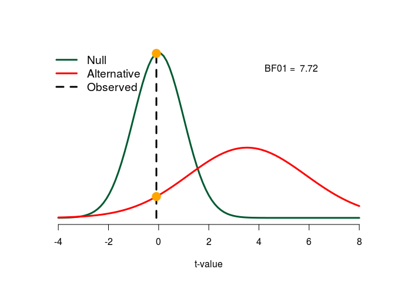

bayesEd
=======

`bayesEd` is an R-package that aims to help to understand the logic of Bayes factors by visualization and by the example of the Bayesian t-test for independent groups. Much of the code in the package was inspired by a blog post by Jeff Rouder (<http://jeffrouder.blogspot.com/2016/01/what-priors-should-i-use-part-i.html>) and extends it to easily usable functions. The code is primarily meant for educational purposes; to actually compute Bayes factors, I encourage the use of the `BayesFactor` package (Morey and Rouder 2015).

Installation
============

``` r
library("devtools") # if not available: install.packages("devtools")
install_github("m-Py/bayesEd")
```

``` r
# load the package via 
library("bayesEd")
```

Visualize prior distributions
=============================

Bayes factors contrast the ability of hypotheses to predict observed data. In the case of the t-test, two hypotheses -- a null hypothesis and an alternative hypothesis -- are contrasted in their ability to predict an observed t-value.[1] In the context of Bayesian statistics, hypotheses are also often referred to by the term "prior". The first step in understanding Bayes factors is to understand the hypotheses/priors. In the case of a Bayesian t-test, both hypotheses have assumptions about the population effect size *d* (Cohen 1988). The null hypothesis always assumes that *d* = 0, i.e., that there is no effect in the population. The default alternative hypothesis -- proposed to be used by psychologists by Rouder et al. (2009) -- assumes that there is an effect in the population. It postulates that the distribution of *d* is described by a Cauchy distribution. The following plot visualizes the Cauchy distribution:

``` r
## Draw default hypotheses:
visualize_prior()
```


The function `visualize_prior` is the first function from the package `bayesEd` that we are using; it simply draws the hypotheses. I called the function without specifying any arguments (see `?visualize_prior` for a description of all parameters that can be passed). In this case by default, the function assumes a Cauchy alternative hypothesis. The shape of the Cauchy distribution is described by a scaling parameter *r*; it describes the proportion of probability mass that lies between −*r* and *r*. The default scaling parameter is sqrt2/2 ≈ 0.71, which is the also the default setting in the package `BayesFactor`. The following plot illustrates the scaling parameter:


In this case, the alternative hypothesis assumes that Cohen's *d* is in between -0.71 and 0.70 in 50% of all cases. Larger effect sizes are assumed to be less common. It is also possible to specify a different prior as the alternative hypothesis. In this case, we have to specify the argument `alternative`; `alternative` is usually a function object describing our believe in the distribution of the population effect size. For example, we may specify an alternative that describes the population effect size as a normal distribution with mean = 0.5 and *SD* = 0.3.

``` r
normal_alt <- function(x) dnorm(x, mean = 0.5, sd = 0.3)
visualize_prior(alternative = normal_alt)
```


Here, we specify a "subjective prior" that a priori assumes a directional effect, i.e., that *d* is most likely larger than 0. The alternative hypothesis is specified by the function `dnorm`, which is the function for the probability density of a normal distribution. Hypothesis objects will typically be a "d"-function, i.e., a probability density function like `dnorm`, `dcauchy` or `dt`.

As an additional example, the following illustrates a change of the scaling parameter in the Cauchy distribution.

``` r
cauchy_narrow <- function(x) dcauchy(x, scale = 0.4)
visualize_prior(alternative = cauchy_narrow)
```


Here, we assume that effect sizes are likely to be smaller -- 50% of effect sizes are assumed to be in the interval of \[-0.4, 0.4\] --, which may be a realistic assumption in psychological research. Note that in any case, the Cauchy distribution assumes that very large effect sizes are more likely than a normal distribution would assume; the Cauchy distribution has "fat tails".

Visualize predictions
=====================

A statistical hypothesis makes predictions about the distribution of observed data. When specifying a probability distribution of Cohen's *d*, we also create specific expectations about the distribution of observed t-values. In the case of the null hypothesis, the distribution of t-values is described by the t-distribution with *n* − 2 degrees of freedom, where *n* is the total sample size:

``` r
visualize_predictions(alternative = NULL, n1 = 50, n2 = 50)
```


The function `visualize_predictions` illustrates the predictions of hypotheses. Here, I only wanted to illustrate the predictions of the null hypothesis and therefore, I set the argument `alternative` to `NULL`. Note that the predictions of a hypothesis do not only depend on the prior, but also on the sample size. For this reason, I used the parameters `n1` and `n2` to specify two hypothetical group sizes of 50, yielding a total *n* of 100.

The argument `alternative` works in the same way as for the function `visualize_priors`. Usually, it is a function object describing the distribution of effect sizes according to the alternative hypothesis. Again, the default alternative is a Cauchy prior with scaling parameter sqrt2/2 ≈ 0.71. The following call illustrates the predictions of the Cauchy prior and the null hypothesis for a sample size of 100:

``` r
visualize_predictions(n1 = 50, n2 = 50)
```


We can see that under the alternative hypothesis, larger t-values are increasingly more likely than under the null hypothesis; according to the null hypothesis, smaller t-values are relatively more likely. The Bayes factor is the relative probability of an observed t-value under both hypotheses. We can pass an observed t-value to `visualize_predictions` to obtain an illustration of the Bayes factor:

``` r
visualize_predictions(n1 = 50, n2 = 50, observed_t = 4)
```


In this case, we assume that we have observed *t* = 4. The resulting Bayes factor of 184 yields astonishing evidence for the alternative hypothesis that there is an effect in the population. The observed t-value is 184 times more likely under the alternative hypothesis than under the null hypothesis. Note that a t-value of 4 would also result in a highly significant p-value under the null hypothesis. The orange dots illustrate the so called *marginal likelihoods*, i.e., the probability density of the observed data under each hypothesis. The ratio of the marginal likelihoods is the Bayes factor.

Using the function `marginal_likelihood` from the package `bayesEd`, we can compute this Bayes factor as the ratio of two marginal likelihoods:

``` r
null_marginal <- dt(4, 98)
alt_marginal <- marginal_likelihood(4, n1 = 50, n2 = 50)
BF10 <- alt_marginal / null_marginal
```

Here, the probability of the data under the null hypothesis is given by the probability density function for the t distribution `dt`. To compute the probability of the data under the alternative hypothesis, we use the function `marginal_likelihood`. As the previous functions that we saw (`visualize_prior` and `visualize_predictions`), `marginal_likelihood` also has an argument `alternative` that specifies the prior distribution for the alternative hypothesis. It also has the same Cauchy default.

Evidence for the null hypothesis
--------------------------------

One of the strengths of Bayes factors is that they can relative quantify evidence in favor of a null hypothesis; classical significance tests relying on p-values do not offer this feature. Look at the following example code:

``` r
## Sample from a polulation with a null effect:
groupn <- 100
group1 <- rnorm(100, 0, 1)
group2 <- rnorm(100, 0, 1)

tvalue <- t.test(group1, group2)$statistic

visualize_predictions(n1 = groupn, n2 = groupn, observed_t = tvalue, BF10 = FALSE)
```


Here, I sample 100 observations per group that do not differ in their population mean, i.e., the effect size in the population is zero. More often than not, I will obtain a Bayes factor that favors the null hypothesis over the alternative hypothesis. To illustrate the evidence in favor of the null as compared to the null hypothesis, I set the argument `BF10` to `FALSE`; run the code to see what happens when this is not done .

I encourage to use the package `BayesFactor` to compute Bayes factors for the t-test that offers more functionality like, for example, the possibility to compute Bayes factors for paired t-tests. To reproduce my analysis above, we can also use the following code employing the package `BayesFactor`:

``` r
library("BayesFactor")
1 / ttestBF(group1, group2) # inverse Bayes factor; evidence for null hypothesis
```

    ## Bayes factor analysis
    ## --------------
    ## [1] Null, mu1-mu2=0 : 6.485053 ±0%
    ## 
    ## Against denominator:
    ##   Alternative, r = 0.707106781186548, mu =/= 0 
    ## ---
    ## Bayes factor type: BFindepSample, JZS

Predictions of different priors
-------------------------------

The primary strength of the package `bayesEd` is that Bayes factors for different priors can be computed and visualized. This may be used for educational purposes, e.g., to teach the Bayes factor to students. The following is a gallery for different priors and their predictions. I use the data from the example above where I sampled 200 observations:

``` r
## Use a point hypothesis as the alternative. In this case, the argument
## alternative is not a function object, but a scalar number:
visualize_prior(0.4)
```


``` r
visualize_predictions(alternative = 0.4, n1 = groupn, n2 = groupn, observed_t = tvalue)
```


``` r
## Use a normal distribution as the alternative
normal_alt <- function(x) dnorm(x, mean = 0.5, sd = 0.3)
visualize_prior(normal_alt)
```


``` r
visualize_predictions(alternative = normal_alt, n1 = groupn, n2 = groupn,
                      observed_t = tvalue, from = -4, to = 8, BFx = 4,
                      BFy = dt(0, 198) * 0.9, BF10 = FALSE)
```



Also see `?visualize_predictions` for a description of all arguments of the function.

References
==========

Cohen, J. 1988. *Statistical Power Analysis for the Behavioral Sciences*. 2nd ed. Hillsdale, NJ: Lawrence Erlbaum.

Morey, R D, and J N Rouder. 2015. *BayesFactor: Computation of Bayes Factors for Common Designs*. <https://CRAN.R-project.org/package=BayesFactor>.

Rouder, J N, P L Speckman, D Sun, R D Morey, and G Iverson. 2009. “Bayesian T Tests for Accepting and Rejecting the Null Hypothesis.” *Psychonomic Bulletin & Review* 16 (2). Springer: 225–37.

[1] In general, Bayes factors do not require that one of the hypotheses is a null hypothesis. But it is often the case, especially for default Bayes factors.
